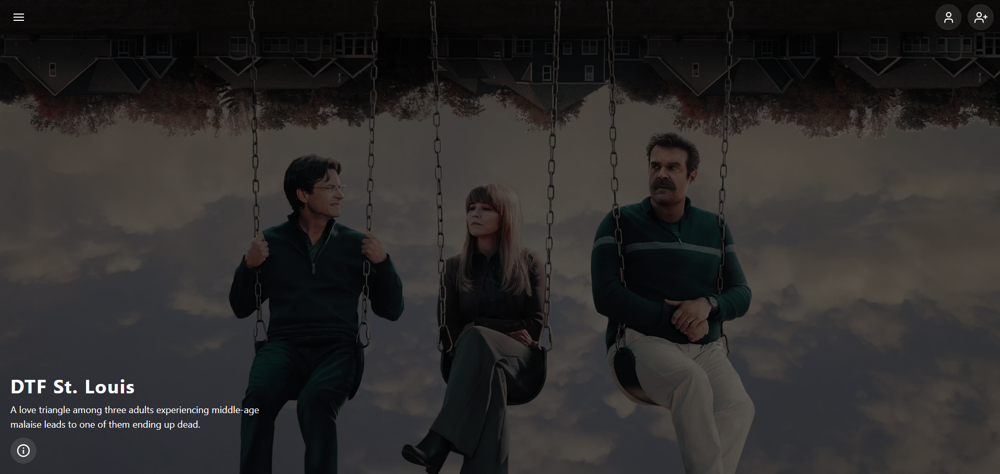

# 🎬 MERN Film Review Application

A full-stack Film Review web application built using the **MERN stack** (MongoDB, Express, React, Node.js).  
Users can browse movies, read reviews, and submit their own ratings and comments.

---

## 🚀 Live Demo

- 🌐 **Frontend:** https://film-review-application.vercel.app/
- 🔗 **Backend API:** https://film-review-application.onrender.com

---

## ⚠️ Important Note (Backend Cold Start)

> The backend server is deployed on **Render (render.com)**.  
> Since it is hosted on a free tier, the server may go to sleep after inactivity.
>
> ⏳ The first request may take **up to 50 seconds** due to cold start.  
> After the initial request, the API will respond normally.

Thank you for your patience!

---

## 📸 Screenshot

### 🏠 Home Page

---

## 🧰 Tech Stack

### 💻 Frontend

- React
- Axios
- Tailwind CSS

### 🖥️ Backend

- Node.js
- Express.js
- MongoDB
- Axios

### 🌐 Deployment

- Frontend: Vercel
- Backend: Render

---

## ✨ Features

- 🎥 Browse movies
- ⭐ View ratings and reviews (In development)
- ✍️ Add new reviews (In development)
- 🔐 User authentication (PassportJS)
- 🗂️ RESTful API
- 📱 Responsive design
- ☁️ Deployed backend
