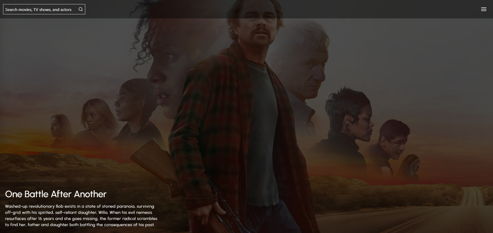

# 🚀Film Review Application

A full-stack MERN application that allows users to rate and leave reviews for movies and TV shows.

---

## 🌐 Live Demo

👉 [https://film-review-application.vercel.app](https://film-review-application.vercel.app/)

---

## 🖼️ Preview

---

## 🛠️ Tech Stack

### Client

- React
- Axios
- React Router
- Tailwind CSS
- React-Spinner
- Swiper
- Motion
- React Intersection Observer
- Lucid React

### Server

- Node.js
- Express.js
- MongoDB / Mongoose
- cors
- Nodemon

## ✨ Features

- 🔍 Search for movies and TV shows in real-time
- ⭐ Add and view user reviews
- 📱 Fully responsive design (works on mobile, tablet, and desktop)

## ⚠️ Important Note

> ⚡ **Server Cold Start Delay**  
> The backend is deployed on Render. If the server remains inactive for a long period of time, it may go to sleep.  
> When this happens, the first request can take **30–60 seconds** to respond while the server spins back up.
